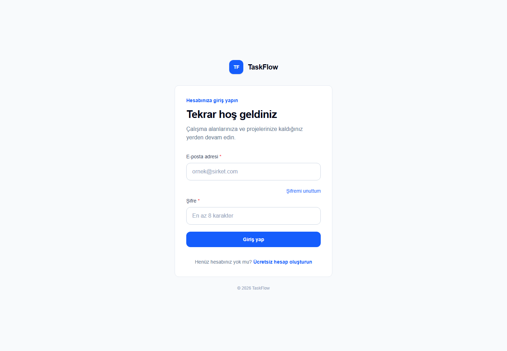
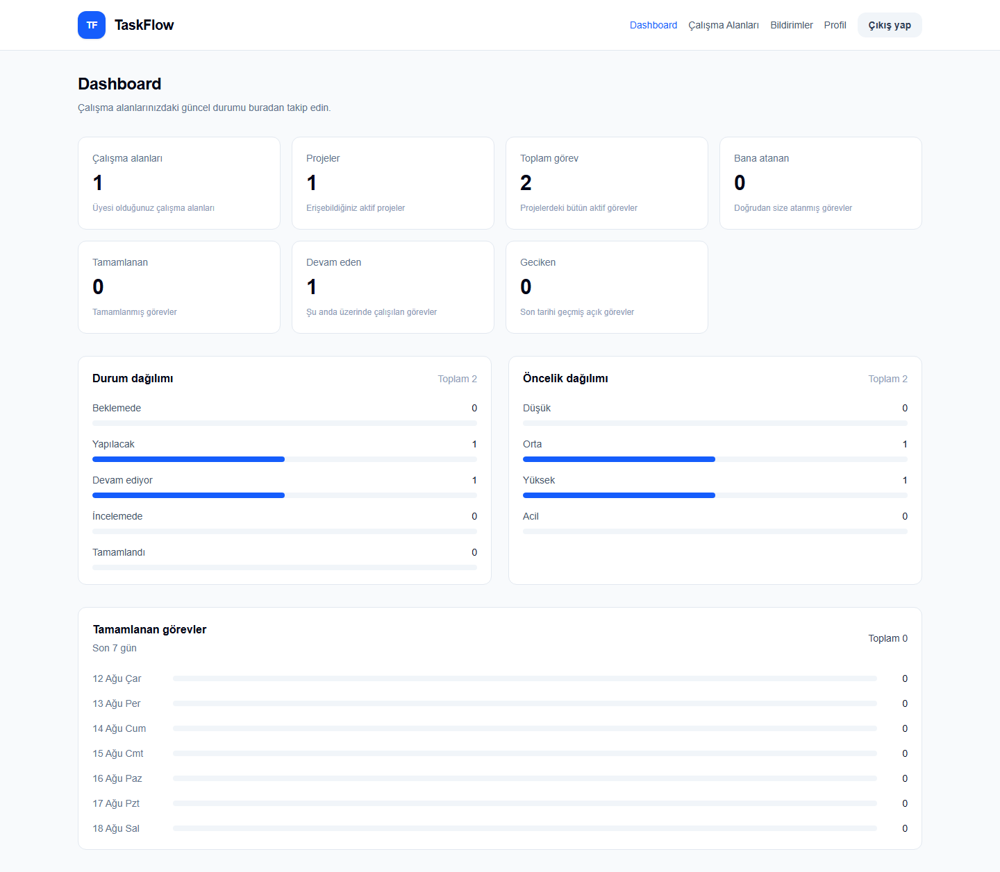
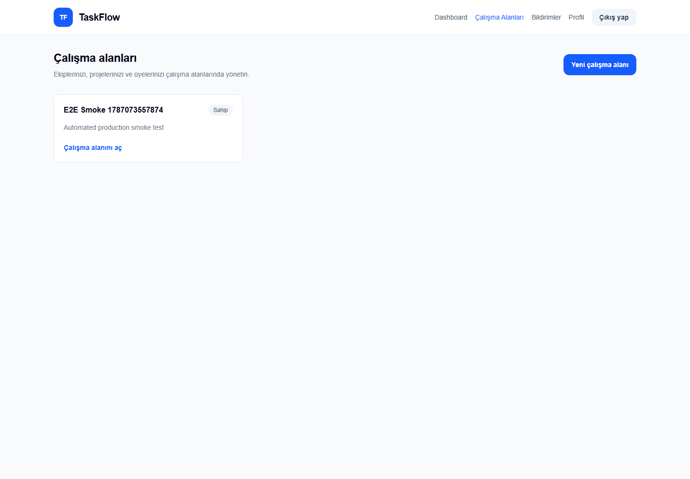

# TaskFlow

TaskFlow; çalışma alanı, proje ve görev yönetimini tek uygulamada birleştiren tam yığın bir örnek projedir. NestJS API, Next.js web arayüzü, PostgreSQL ve pg-boss tabanlı arka plan işlerinden oluşur.

## Özellikler

- Access/refresh token ile kayıt, giriş, çıkış, profil ve şifre yönetimi
- Owner, admin ve member rollerine göre workspace yetkilendirmesi
- Workspace, üye, proje ve görev CRUD işlemleri
- Arama, filtre, sıralama ve sayfalama
- Kanban görünümü ve iyimser durum güncellemesi
- Görev yorumları ve PDF/JPEG/PNG dosya ekleri
- Okunmamış sayılı bildirim merkezi
- CSV ile toplu görev aktarımı, ilerleme ve hatalı satır raporu
- Dashboard özetleri ve audit log
- pg-boss ile bildirim, e-posta, audit, deadline ve import workerları
- Rate limit, DTO doğrulama, global hata filtresi ve parametrik SQL

## Mimari

```text
Tarayıcı (Next.js)
        |
        | HTTP + JWT
        v
NestJS API -----> PostgreSQL
    |
    +----------> pg-boss workerları
                    |- bildirim
                    |- e-posta
                    |- audit log
                    |- deadline reminder
                    `- CSV parse / batch insert
```

Frontend her özellikte aynı katman sırasını kullanır:

```text
types -> service -> hook -> component -> app/page
```

- `types`: API’ye giden ve API’den dönen verinin TypeScript şekli.
- `service`: HTTP endpoint çağrıları.
- `hook`: loading, error, state ve işlem akışı.
- `component`: arayüz ve kullanıcı etkileşimi.
- `page`: URL’yi erişilebilir yapan Next.js route dosyası.

Detaylı şema için [veritabanı dokümanına](docs/database-schema.md) bakın.

## Ekran görüntüleri

### Giriş



### Dashboard



### Çalışma alanları



## Hızlı başlangıç: Docker

Gereksinimler: Docker Desktop ve Docker Compose.

1. `.env.example` dosyasını `.env` olarak kopyalayın.
2. `JWT_SECRET` değerini en az 32 karakterlik rastgele bir değerle değiştirin.
3. E-posta gönderilecekse SMTP alanlarını doldurun.
4. Servisleri başlatın:

```bash
docker compose up -d --build
docker compose ps
```

Adresler:

- Web: `http://localhost:3000`
- API: `http://localhost:4000`
- PostgreSQL (host): `localhost:5433`

Compose önce PostgreSQL healthcheck’ini bekler, sonra `migrate` servisi uygulanmamış SQL dosyalarını çalıştırır. API migration tamamlandıktan, web ise API sağlıklı olduktan sonra başlar.

```bash
docker compose run --rm migrate
docker compose logs --tail=100 api
docker compose logs --tail=100 web
docker compose down
```

`docker compose down` veritabanı ve upload volume’larını silmez. Verileri silen `down -v` komutunu yalnız gerçekten sıfırlamak istediğinizde kullanın.

## Yerel geliştirme

PostgreSQL’i Docker ile çalıştırıp API ve web’i host üzerinde açabilirsiniz:

```bash
docker compose up -d postgres
docker compose run --rm migrate
npm --prefix api install
npm --prefix web install
```

Yerel API için `DATABASE_HOST=localhost` ve `DATABASE_PORT=5433` kullanın.

```bash
npm --prefix api run start:dev
npm --prefix web run dev
```

## Roller

| İşlem | Owner | Admin | Member |
| --- | :---: | :---: | :---: |
| Workspace güncelle/sil | Evet | Hayır | Hayır |
| Üye ekle/rol değiştir/çıkar | Evet | Evet | Hayır |
| Proje oluştur/güncelle/sil | Evet | Evet | Hayır |
| Görev oluştur/sil/atama | Evet | Evet | Hayır |
| Atandığı görevin durumunu güncelle | Evet | Evet | Evet |
| Yorum ekle, kendi yorumunu düzenle | Evet | Evet | Evet |
| Yorum veya dosya sil | Evet | Evet | Hayır |
| CSV aktar | Evet | Evet | Hayır |

Üye workspace’ten çıkarıldığında tamamlanmamış ve o üyeye atanmış görevlerin `assigned_to` alanı `NULL` yapılır. Tamamlanmış görevlerin geçmiş atama bilgisi korunur.

## Token akışı

Access token kısa ömürlüdür. Ortak web API servisi 401 cevabı alırsa refresh token ile bir kez yeni token çifti ister ve ilk isteği tekrarlar. Aynı anda gelen 401 cevapları tek refresh isteğini paylaşır. Refresh geçersizse yerel tokenlar temizlenir ve kullanıcı giriş sayfasına yönlendirilir.

## CSV biçimi

Başlıklar tam olarak şu sırada olmalıdır:

```csv
title,description,status,priority,due_date,assigned_email
```

- `status`: `backlog`, `todo`, `in_progress`, `review`, `completed`
- `priority`: `low`, `medium`, `high`, `urgent`
- `due_date`: boş veya geçerli ISO tarih (`YYYY-MM-DD` önerilir)
- `assigned_email`: boş veya aynı workspace’in aktif bir üyesi
- Maksimum dosya boyutu: 25 MB
- Batch boyutu: 500 satır

Örnekler [samples/csv](samples/csv) klasöründedir. Performans dosyalarını yeniden üretmek için:

```bash
node scripts/generate-test-csv.mjs
```

Her 100. satır bilerek hatalı status içerir; böylece satır izolasyonu test edilir.

## API koleksiyonu

[TaskFlow Postman koleksiyonu](docs/TaskFlow.postman_collection.json) temel endpointleri ve ortam değişkenlerini içerir. Login isteğinin test script’i `accessToken` ve `refreshToken` değişkenlerini otomatik kaydeder. ID değişkenlerini oluşturduğunuz kayıtlarla güncelleyin.

## Test ve kalite komutları

```bash
npm --prefix api test -- --runInBand
npm --prefix api run build
npm --prefix api run test:e2e
npx --prefix api eslint "{src,test}/**/*.ts"

npm --prefix web run lint
npm --prefix web run build
npm --prefix web audit --omit=dev
npm --prefix api audit --omit=dev
node scripts/smoke-test.mjs
```

`smoke-test.mjs`, Gmail plus-address kullanarak geçici bir test kullanıcısı oluşturur; auth, workspace, proje, görev, yorum, attachment, CSV import, dashboard, token yenileme ve e-posta kuyruğunu gerçek çalışan servisler üzerinde sınar. Test workspace'i sonunda temizlenir.

E2E testi host üzerinden Docker PostgreSQL’e bağlanırken:

```powershell
$env:DATABASE_HOST='localhost'
$env:DATABASE_PORT='5433'
npm.cmd --prefix api run test:e2e
```

Son doğrulamada 21 unit test paketi/37 test, 1 E2E testi, API ve web production buildleri başarıyla geçti. Docker üzerinde auth, workspace, üyelik, proje, görev atama, member yetkisi, yorum, bildirim, attachment, dashboard, refresh token ve CSV satır izolasyonu smoke test edildi.

## Güvenlik ve saklama

- Parolalar bcrypt ile hashlenir; refresh ve reset tokenları düz metin tutulmaz.
- SQL sorguları parametrelidir.
- DTO alanları global `ValidationPipe` ile whitelist edilir.
- Upload MIME ve boyut kontrolleri hem web hem API tarafında yapılır.
- Attachment dosyaları `api_uploads` Docker volume’unda UUID adıyla saklanır.
- Silinen workspace/proje/görev kayıtları soft delete ile erişimden çıkarılır.
- `.env` içindeki secret ve SMTP bilgilerini repoya eklemeyin.

## Önemli klasörler

```text
api/                 NestJS API ve workerlar
web/                 Next.js App Router arayüzü
db/migrations/       Sıralı PostgreSQL migrationları
db/migrate.sh        Migration runner
docs/                Şema ve Postman koleksiyonu
samples/csv/         CSV örnekleri ve performans dosyaları
scripts/             Yardımcı üretim scriptleri
```
