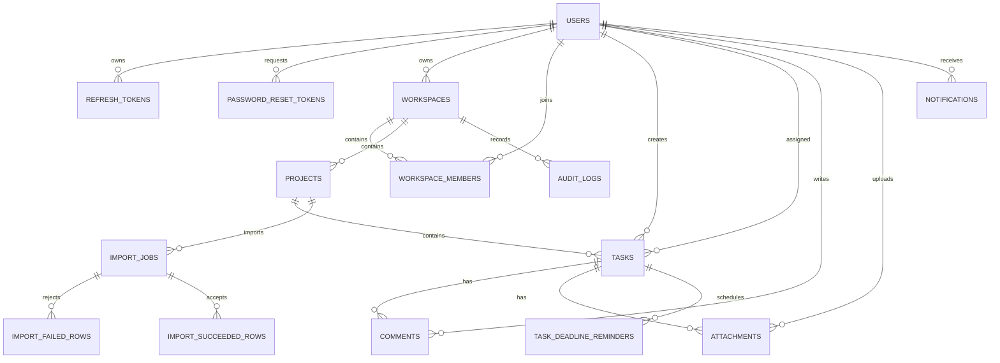

# TaskFlow veritabanı şeması

Ana ilişkiler aşağıdaki gibidir. pg-boss kendi tablolarını `pgboss` şemasında yönetir; diyagramda yalnız uygulama tabloları gösterilir.



## Temel kararlar

- Tüm ana kimlikler UUID’dir.
- `workspaces`, `projects`, `tasks` ve `comments` soft delete alanı taşır.
- Workspace üyeliği `(workspace_id, user_id)` için tektir.
- `event_id`, notification ve audit workerlarında retry sırasında duplicate kaydı engeller.
- Import başarılı satır tablosundaki `(import_job_id, row_number)` benzersizliği batch retry işlemini idempotent yapar.
- Dashboard ve deadline sorguları için kısmi indexler bulunur.
- `schema_migrations`, çalıştırılan SQL dosyalarını kaydeder.

## Migration ekleme

Yeni dosyayı üç haneli sıra numarasıyla ekleyin:

```text
014_feature_name.sql
```

Sonra çalıştırın:

```bash
docker compose run --rm migrate
```

Migration dosyası uygulandıktan sonra adı `schema_migrations` tablosuna yazılır. Daha önce uygulanmış dosyalar tekrar çalıştırılmaz.
